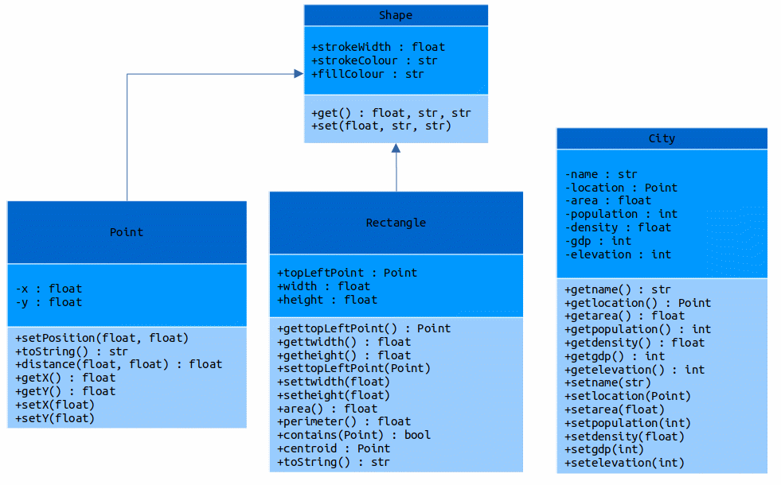

# Data and Sources

The data used in this program refers to several information about cities in Switzerland and Germany. The cities are [Zürich](https://en.wikipedia.org/wiki/Zürich), [Geneva](https://en.wikipedia.org/wiki/Geneva), [Basel](https://en.wikipedia.org/wiki/Basel), [Lausanne](https://en.wikipedia.org/wiki/Lausanne), [Bern](https://en.wikipedia.org/wiki/Bern), [Berlin](https://en.wikipedia.org/wiki/Berlin), [Hamburg](https://en.wikipedia.org/wiki/Hamburg), [Düsseldorf](https://en.wikipedia.org/wiki/Düsseldorf), [Munich](https://en.wikipedia.org/wiki/Munich), and [Dresden](https://en.wikipedia.org/wiki/Dresden).

The data about about the city are the following :

* name : name of the city

* location : Geographical decimal coordinates of the city

* area : area of the city in squared km

* population : number of inhabitants

* density : population density (inhabitans/km²)

* GDP : Gross Domestic Product in billion Euros

* Elevation : mean altitude of the city in meters.

All the information about the cities was retrieved from [Wikipedia](https://www.wikipedia.org/) and the coordinates were extracted from a website called [LATITUDE](https://latitude.to/). The polyline line data of the coastline of Europe was obtained as part of the class of Introduction of Software Programming from the Msc in Geoinformatics and Spatial Data Science at WWU.

# Defined Classes and UML class diagrams

The following figure demonstrates how classes were defined for the execution of this program.

